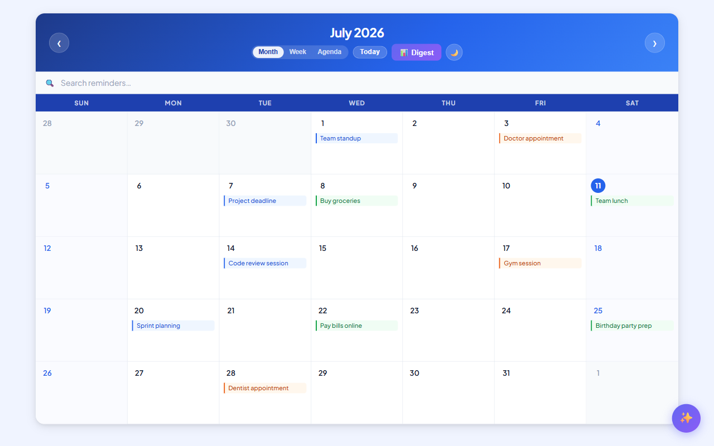

# React AI Calendar

A calendar app with AI-powered reminder management, built with React 19, TypeScript, Vite 8, and the Groq API.

## Live demo

[https://react-calendar-seven-beta.vercel.app](https://react-calendar-seven-beta.vercel.app)



## Features

### AI
- **Smart Add** — describe a reminder in plain English ("Dentist next Friday at 2pm") and the AI extracts the date, time, category, and recurrence automatically, pre-filling the form for review before saving
- **AI Assistant** — floating chat panel powered by Groq (Llama 3.3 70B); ask questions about your schedule in natural language ("What do I have this week?", "Am I free on Monday?") and get streaming answers with full awareness of your current reminders
- **AI Smart Reschedule** — open any reminder's detail view and ask the AI to move it ("push to next Monday morning"); the model picks a conflict-free slot, explains its reasoning, and moves the reminder on confirmation
- **Conflict Detection** — when adding a reminder, the form instantly warns if another reminder already occupies the same time slot on the same day
- **Weekly AI Digest** — click 📊 Digest in the header to get a streaming AI summary of the current week: overview, busiest day, free slots, work/health/personal balance, and a personalized scheduling tip

### Calendar
- **Multiple views** — Month, Week, and Agenda; switch instantly without losing state
- **Reminder management** — add, edit, and delete reminders with title, time, category, and recurrence
- **Drag and drop** — move reminders between days directly on the month grid
- **Recurring reminders** — set daily, weekly, or monthly recurrence; instances are expanded at render time without mutating stored state
- **Search** — filter reminders across all views; matching pills highlight, non-matching ones dim
- **Categories** — Work, Personal, Health, and Other, each with a distinct color in both light and dark mode
- **Keyboard shortcuts** — `N` new reminder, `T` today, `M/W/A` switch views, `←/→` prev/next month, `Esc` close any modal
- **Today button** — jump back to the current month from anywhere
- **Dark mode** — toggle between light and dark themes; preference is saved across sessions
- **Responsive** — fully usable on mobile; week view scrolls horizontally, month view fills the screen
- **Persistent storage** — all reminders are saved in `localStorage` and survive page refreshes

## Project structure

```
src/
├── components/
│   ├── AiChat.tsx            # Floating AI assistant chat panel with streaming responses
│   ├── AiInput.tsx           # Smart Add — natural language input inside the reminder form
│   ├── AgendaView.tsx        # Chronological list view of reminders
│   ├── Calendar.tsx          # Main component: grid, state, routing between views
│   ├── DeleteConfirmation.tsx
│   ├── ReminderDetailView.tsx
│   ├── ReminderForm.tsx      # Add / edit form with AI Smart Add integration
│   ├── ReminderForm.test.tsx
│   ├── ReminderList.tsx      # Overflow popup for days with many reminders
│   ├── SearchBar.tsx
│   ├── WeekView.tsx          # Hourly week grid with category-colored events
│   └── WeeklyDigest.tsx      # Streaming AI weekly digest modal
│   └── YearSelector.tsx
├── interfaces/               # TypeScript types for reminders and component props
├── services/
│   └── geminiService.ts      # Groq API integration: NL parsing + streaming chat
├── state/
│   └── remindersReducer.tsx  # Reducer handling add / edit / delete / move actions
└── utils/
    └── constants.tsx         # Shared constants and category color palettes
```

## Design decisions

**Natural language parsing via Groq** — the Smart Add field sends user input to Llama 3.3 70B with a structured prompt that enforces JSON output. The response is parsed and used to pre-fill the form; the user always reviews before saving, so hallucinated dates can be corrected.

**Streaming chat with calendar context injection** — the AI assistant passes the user's full reminder list as a system prompt on every request. Groq's SSE stream is consumed with a `ReadableStream` reader and chunks are appended to the message in real time via React state updates.

**Recurring reminders expanded at render time** — recurrence instances are computed by `expandRecurring()` outside the component on each render, never stored, keeping the source state clean and deletions simple.

**Reducer for state management** — all reminder mutations go through `remindersReducer`, keeping add/edit/delete/move logic in one place and making the state predictable.

**CSS custom properties for theming** — the dark mode toggle flips a `data-theme` attribute on the root element; every color in the app is a CSS variable that overrides automatically. No runtime style injection needed.

**localStorage with lazy reducer init** — the reducer is initialized from `localStorage` using the third argument of `useReducer` (the lazy initializer), so the app never renders with an empty state that immediately gets replaced.

## Tech stack

| Tool | Version / Detail |
|------|-----------------|
| React | 19.2 |
| TypeScript | 5.9 |
| Vite | 8 |
| Vitest | 4 |
| Day.js | 1.11 |
| React Testing Library | 16 |
| ESLint | 10 |
| Groq API | Llama 3.3 70B Versatile |

## Setup

Create a `.env` file in the project root with your [Groq API key](https://console.groq.com):

```sh
VITE_GROQ_API_KEY=your_key_here
```

## Installation

```sh
npm install
npm run dev
```

## Running tests

```sh
npm test
```
